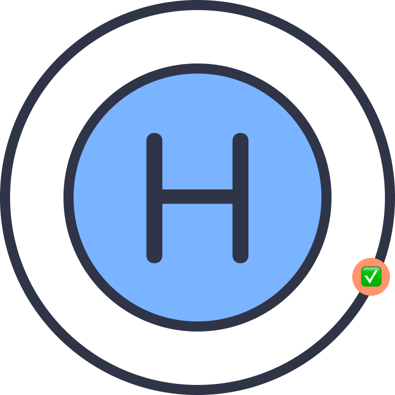

<p align="center">
    
</p>

<p align="center">
    
    <a href="https://mastodon.social/@TaylorLineman">
        
    </a>
</p>

# Hydrogen Reporter
A fast and lightweight SwiftUI console and view state reporter that can be used to see active logs and system statistics. Extremely useful for on the go debugging or when your apps need to be debugged over long periods of times that you can't be connected to a computer for!

## Features
- View and debug SwiftUI view state during app execution with no computer
- Debug custom types with a simple extension
- View current device statistics such as Ram and CPU usage
- Add custom debug views to the reporter view
- Only active during Debug sessions so no need to worry about removing for production!
- View custom logs as they get sent to the console
- View console output in app without the need for a connected debugger.

### Export Logs
An example exported log!

```
Hydrogen Reporter logs for 2023-04-23T15:22:07.650-04:00
--- ✨ Total Logs: 23 ---
--- 🛑 Total Fatal Error Logs: 0 ---
--- 🥲 Total Error Logs: 2 ---
--- ⚠️ Total Warn Logs: 2 ---
--- 🤖 Total Info Logs: 10 ---
--- ✅ Total Success Logs: 5 ---
--- ⚙️ Total Working Logs: 6 ---
--- 🔵 Total Debug Logs: 0 ---
--- Fatal % 0 - Error % 0 - Warn % 0 - Info % 0 - Success % 0 - Working % 0 - Debug % 0 ---
=== START LOGS ===
⚙️ Establishing Stream - ~/StreamingManager.swift @ line 187, in function establishStream()
✅ Web Socket did connect - ~/StreamingManager.swift @ line 384, in function urlSession(_:webSocketTask:didOpenWithProtocol:)
🤖 Received Message - ~/StreamingManager.swift @ line 208, in function receive()
🤖 Received Message - ~/StreamingManager.swift @ line 208, in function receive()
🤖 Stream Cancelled - ~/StreamingManager.swift @ line 224, in function stopWatchingStream()
🤖 Web Socket did close - ~/StreamingManager.swift @ line 405, in function urlSession(_:webSocketTask:didCloseWith:reason:)
⚙️ Establishing Stream - ~/StreamingManager.swift @ line 187, in function establishStream()
✅ Web Socket did connect - ~/StreamingManager.swift @ line 384, in function urlSession(_:webSocketTask:didOpenWithProtocol:)
=== END LOGS ===
```

## Getting Started
### Swift Package Manager
Add the following url to your Swift Packages through Xcode
```
https://github.com/ActuallyTaylor/HydrogenReporter
```

### Sample Code
#### Initialization
To get started first import `HydrogenReporter` and then add the `.hydrogenReporter()` view modifier to your main view. This will initalize the reporter and add the floating menu to your app. The next step is to add your logger configuration so that Hydrogen can adapt to your needs. This is done by calling `Logger.shared.setLoggerConfig(config:)`.

```swift
import HydrogenReporter

struct SampleApp: App {

    init() {
            Logger.shared.setLoggerConfig(config: .init(applicationName: "Hydrogen Reporter", defaultLevel: .info, defaultComplexity: .simple, leadingEmoji: "⚫️"))
    }

    var body: some Scene {
        WindowGroup {
            ContentView()
                .hydrogenReporter()
        }
    }
}
```

#### Adding a SwiftUI view to the reporter
To add your custom view to the reporter menu you just need to add the `.debuggable(self, id: "ID")` modifier to any view. This will register it with the reporter and allow you to view it's debuggable properties!

This sample adds the following Sample View to the reporter with the tag of Main View
```swift
struct SampleView: View {
    @State var string: String = "Hello World"

    var body: some View {
        NavigationView {
            VStack {
                TextField("Text", text: $string)
                    .textFieldStyle(.roundedBorder)

                Button("Log Error") {
                    LOG("You just broke everything", level: .error)
                }
                Button("Log Warning") {
                    LOG("You should not have done that", level: .warn)
                }
                Button("Log Info") {
                    LOG("Chilling", level: .info)
                }
                Button("Log Success") {
                    LOG("That worked!", level: .success)
                }
                Button("Log Working") {
                    LOG("Working on something...", level: .working)
                }
                Button("Log Debug") {
                    LOG("Print Debugging is where it is at", level: .debug)
                }
            }
        }
        .debuggable(self, id: "Main View")
    }
}
```

#### Adding custom views to the reporter's menus
If you have custom needs for what you want to appear in the reporter (A custom debug menu) you can easily make Hydrogen take care of this view by adding it by registering it using the `.customDebuggableView()` modifier!. Just provide the view and then an ID to identify the view.

```swift
struct SampleView: View {
    @State var string: String = "Hello World"

    var body: some View {
        NavigationView {
            VStack {
                TextField("Text", text: $string)
                    .textFieldStyle(.roundedBorder)
        }
        .customDebuggableView(customView, id: "Custom View")
    }
    
    var customView: some View {
        VStack {
            Text("A Custom View!")
            Text("Some State \(string)")
        }
    }
}
```

### Logger
The Hydrogen Logger has the ability to swizzle the actual console output of your app and display it inside of the Hydrogen Reporter. This allows you to view console output as it happens without the need to switch away from print statements.

If you wish to see output within the `Logger` portion of Hydrogen reporter you can switch all (or some) of your `print` statements with `LOG`. `LOG` internally uses the same functions as `print` so the output will be nearly identical.

I would recommend moving your `print` statements to `LOG` statements as they allow for you to set their awareness level and see a more comprehensive

#### Using the logger
To use the logger you can call the function `LOG` for example:

```swift
// Log a simple message
LOG("Completed Setup")

// Log an Error
LOG("Purchasing Error:", error, level: .error)

// Debug Information
LOG("Passed section 3", level: .debug)
```

# Contact
Any questions that you have can be directed towards the GitHub issues or my [Mastodon account](https://mastodon.social/@TaylorLineman)!
